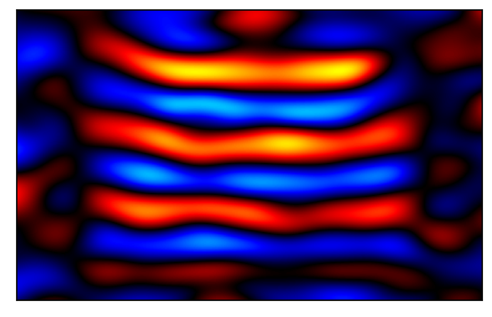

# SIREN for magnetic resonance elastography

The goal of this project is to perform elasticity reconstruction for magnetic resonance elastography using sinusoidal representation networks (SIRENs).



This image shows the continuous representation of a shear wave image learned using SIREN, which enables super-resolution and solving of partial differental equations.

## Environment setup

```
conda env create -n MRE-SIREN --file environment.yml
conda activate MRE-SIREN
python -m ipykernel install --user --name=MRE-SIREN
```

## Project organization

- `mre_siren/`: Python code module
  - `bioqic.py`: Code for working with BIOQIC data set
  - `models.py`: Torch implementation of SIREN
  - `pde.py`: Torch differential operators
  - `phase.py`: Numpy wave image preprocessing and MDEV
- `notebooks/`: Jupyter notebooks
  - `BIOQIC-data-exploration.ipynb`: Loading and visualizing the BIOQIC data set
  - `MDEV-inversion-method.ipynb`: Development of phase preprocessing and MDEV inversion in Python
  - `SIREN-testing.ipynb`: Initial toy implementation of SIREN model on random data
  - `MRE-SIREN-training.ipynb`: Training SIREN on the BIOQIC data set and performing inversion
  - `MRE-SIREN-optimization.ipynb`: SIREN hyperparameter search for elasticity reconstruction
  - `MRE-SIREN-evaluation.ipynb`: Ground truth evaluation of SIREN compared to MDEV
- `download_data.sh`: Script to download BIOQIC data set
- `environment.yml`: Conda environment file
- `train.py`: Main training script

